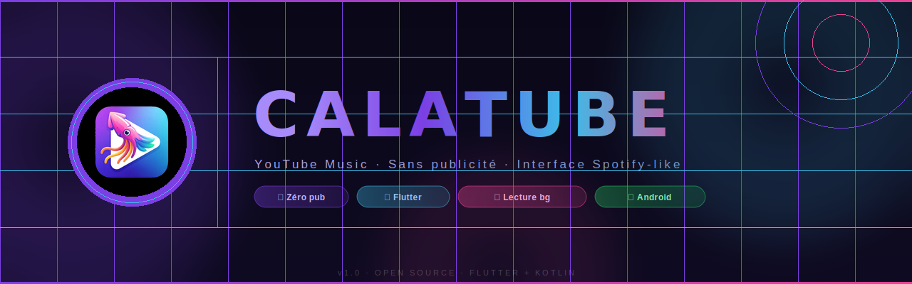
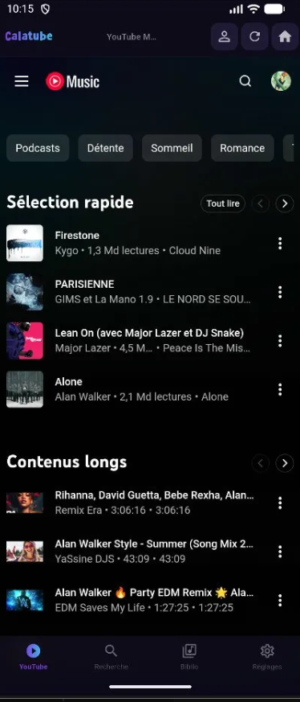
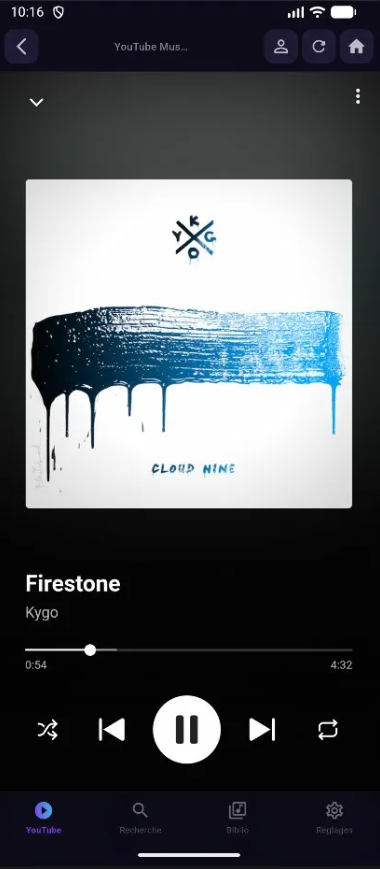
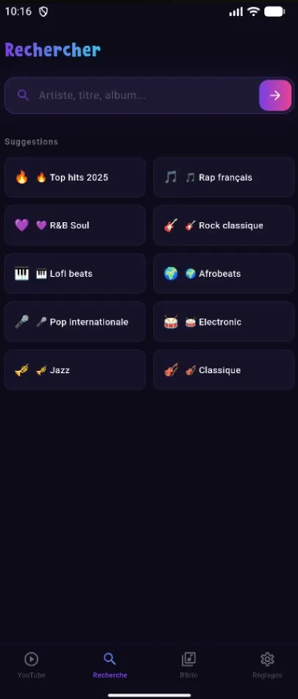
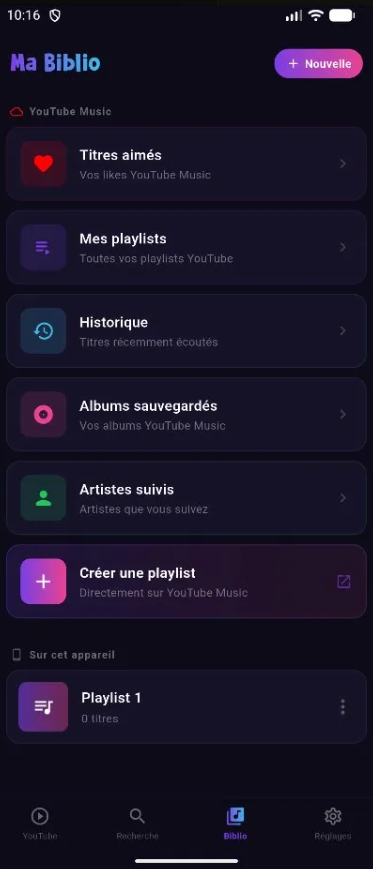
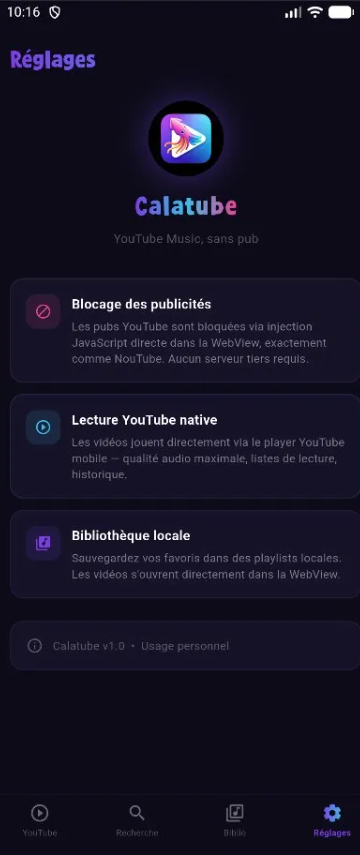

<div align="center">

<!-- BANNER -->


<br/>

<!-- BADGES -->


<br/>

> **🦑 Calatube** — L'interface Spotify-like pour YouTube Music.  
> Lecture sans pub, audio en arrière-plan, notifications MediaStyle, bibliothèque native.

</div>

---

## 🎯 Présentation

**Calatube** est une application Android construite avec Flutter qui enveloppe YouTube Music dans une interface sombre et épurée inspirée de Spotify. Elle bloque toutes les publicités via injection JavaScript directe dans la WebView (principe identique à NouTube), sans aucun serveur tiers requis.

La lecture continue même écran verrouillé, les contrôles s'affichent dans la barre de notifications, et les boutons media (casque, Bluetooth) sont entièrement fonctionnels.

---

## 📸 Aperçu

<div align="center">

| 🏠 Accueil | 🎵 Lecteur | 🔍 Recherche | 📚 Bibliothèque | ⚙️ Réglages |
|:---:|:---:|:---:|:---:|:---:|
|  |  |  |  |  |

</div>

---

## ✨ Fonctionnalités

### 🚫 Blocage des publicités
- Injection JavaScript directe dans la WebView au chargement de chaque page
- Suppression CSS des slots publicitaires (`ad-slot-renderer`, `ytm-display-ad-renderer`, etc.)
- Interception `fetch` et `XMLHttpRequest` → suppression des données publicitaires dans les réponses API YouTube (`adPlacements`, `adSlots`, `playerAds`)
- Skip automatique des pubs vidéo (bouton skip simulé + saut de timestamp)
- Refus automatique du cookie consent
- Suppression de la bannière "Ouvrir dans l'app YouTube"

### 🎵 Lecture native YouTube Music
- WebView chargée avec l'User-Agent mobile Chrome → interface YouTube Music complète
- Player natif YouTube avec accès aux listes de lecture, mix automatiques, recommandations
- Cookies partagés entre toutes les sessions → connexion Google persistante

### 📱 Lecture en arrière-plan
- `CalatubeMediaService` — Service Android foreground de type `mediaPlayback`
- Audio focus Android géré proprement (pause si appel entrant, débrancher casque, etc.)
- `MediaSession` active → compatible verrouillage écran, appareils Bluetooth, Android Auto
- Notification MediaStyle avec :
  - Pochette d'album chargée depuis l'URL YouTube
  - Titre et artiste en temps réel
  - Boutons ⏮ ⏯ ⏭ fonctionnels
  - Mise à jour instantanée au changement de titre

### 🔔 Bridge JavaScript → Flutter → Android
- Channel JS `CalatubeFlutter` : la WebView envoie les events de lecture à Flutter
- Surveillance directe de la balise `<video>` (plus fiable que `onStateChange`)
- Events : `nowPlaying` (titre/artiste/pochette/durée), `playState` (pause/play), `progress` (position)
- `MethodChannel` Flutter ↔ Android pour transmettre les infos au `MediaService`

### 🔍 Recherche intégrée
- Barre de recherche avec suggestions par genre (Top hits, Rap français, Lofi beats, etc.)
- Résultats affichés directement dans la WebView YouTube Music
- Navigation SPA préservée (back, historique)

### 📚 Bibliothèque
**YouTube Music (via WebView)**
- ❤️ Titres aimés
- 🎵 Mes playlists
- 🕐 Historique
- 💿 Albums sauvegardés
- 👤 Artistes suivis
- ➕ Créer une playlist directement sur YouTube Music

**Playlists locales (sur l'appareil)**
- Création de playlists locales nommées
- Ajout de titres YouTube
- Suppression et gestion
- Ouverture directe d'un titre dans la WebView

### ⚙️ Réglages
- Informations sur l'app et les technologies
- Accès rapide à la connexion Google
- Version et mentions légales

---

## 🏗️ Architecture

```
calatube/
├── android/
│   └── app/src/main/kotlin/com/calatube/app/
│       ├── MainActivity.kt          # MethodChannel bridge + CookieManager
│       └── CalatubeMediaService.kt  # Foreground service + MediaSession + AudioFocus
│
├── assets/
│   ├── noutube_inject.js            # Script JS d'injection (blocage pubs + bridge)
│   └── images/
│
├── lib/
│   ├── main.dart                    # App entry + thème + providers
│   ├── screens/
│   │   ├── main_shell.dart          # Navigation 4 onglets
│   │   ├── youtube_screen.dart      # WebView principale + top bar
│   │   ├── search_shell.dart        # Recherche + suggestions
│   │   ├── library_screen.dart      # Bibliothèque YT + playlists locales
│   │   └── settings_screen.dart     # Réglages
│   ├── services/
│   │   ├── media_service.dart       # Bridge Flutter → CalatubeMediaService
│   │   ├── now_playing_service.dart # État global de lecture (ChangeNotifier)
│   │   └── playlist_service.dart   # CRUD playlists locales (SharedPreferences)
│   └── models/
│       └── track_model.dart         # Modèles Track + Playlist
│
└── pubspec.yaml
```

---

## 🔧 Stack technique

| Composant | Technologie | Rôle |
|---|---|---|
| UI Framework | Flutter 3.x / Dart | Interface cross-composant |
| WebView | `webview_flutter` 4.x | Rendu YouTube Music |
| Service media | Kotlin / Android SDK | Foreground service + MediaSession |
| Ad blocking | JavaScript injection | Suppression pubs sans proxy |
| Bridge JS↔Flutter | `JavaScriptChannel` | Events de lecture en temps réel |
| Bridge Flutter↔Android | `MethodChannel` | Transmission au MediaService |
| État global | `ChangeNotifier` / `Provider` | NowPlayingService |
| Persistance | `SharedPreferences` | Playlists locales |
| Images réseau | `cached_network_image` | Pochettes album |

---

## 🚀 Installation

### Prérequis

- Flutter SDK ≥ 3.0
- Android SDK ≥ 21 (Android 5.0)
- Java 17+

### Build

```bash
# Cloner le repo
git clone https://github.com/ton-user/calatube.git
cd calatube

# Installer les dépendances
flutter pub get

# Lancer en debug
flutter run

# Build APK release
flutter build apk --release

# L'APK se trouve dans :
# build/app/outputs/flutter-apk/app-release.apk
```

### Installation de l'APK

```bash
# Via ADB
adb install build/app/outputs/flutter-apk/app-release.apk
```

Ou copier l'APK sur l'appareil et l'installer manuellement (activer "Sources inconnues" dans les paramètres Android).

---

## 📦 Dépendances principales

```yaml
dependencies:
  flutter:
    sdk: flutter
  webview_flutter: ^4.9.0
  webview_flutter_android: ^3.16.9
  provider: ^6.1.2
  shared_preferences: ^2.3.2
  cached_network_image: ^3.4.1
  http: ^1.2.2

android:
  compileSdkVersion: 34
  minSdkVersion: 21
  targetSdkVersion: 34
```

---

## 🔐 Permissions Android

```xml
<uses-permission android:name="android.permission.INTERNET"/>
<uses-permission android:name="android.permission.WAKE_LOCK"/>
<uses-permission android:name="android.permission.FOREGROUND_SERVICE"/>
<uses-permission android:name="android.permission.FOREGROUND_SERVICE_MEDIA_PLAYBACK"/>
<uses-permission android:name="android.permission.POST_NOTIFICATIONS"/>
```

---

## 🎨 Design

| Token | Valeur | Usage |
|---|---|---|
| `kBg` | `#0D0B1A` | Fond principal |
| `kBgSurface` | `#161228` | Cartes / surfaces |
| `kBgCard` | `#1C1530` | Cards secondaires |
| `kPrimary` | `#7B3FE4` | Violet principal |
| `kSecondary` | `#3DBDE8` | Cyan accent |
| `kAccent` | `#E84393` | Rose accent |

Police logo : **SuperWonder** (custom)

---

## ⚠️ Avertissement

Calatube est un projet **personnel** à but éducatif. Il ne distribue, ne stocke et ne redirige aucun contenu YouTube — il affiche simplement le site officiel `music.youtube.com` dans une WebView Android en bloquant les publicités côté client, de la même manière qu'un bloqueur de publicités navigateur.

L'application n'est pas affiliée à YouTube, Google ou Alphabet Inc.

---

## 📄 Licence

Usage personnel. Non distribué commercialement.

---

<div align="center">

Fait avec 🦑 et Flutter

**[⬆ Retour en haut](#)**

</div>
