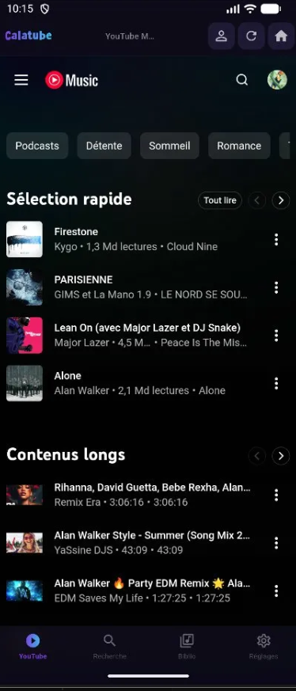

# Calatube

Client Android Flutter qui affiche YouTube Music dans une WebView avec une interface et des commandes média adaptées au téléphone.

**État :** version APK publiée, mais compilation du dépôt et fonctionnement sur appareil non vérifiés dans cet audit. La disponibilité de YouTube Music et des fonctions de lecture dépend du service distant.

## Télécharger

[Télécharger l'APK v2.0.0](https://github.com/0x80070006/Calatube/releases/download/v2.0.0/calatube_v2.0.0.apk) · [Toutes les versions](https://github.com/0x80070006/Calatube/releases)

L'APK est une publication distincte du code actuel : `pubspec.yaml` et la configuration Android indiquent encore `1.0.0`. La correspondance exacte entre l'APK v2.0.0 et les sources de `main` n'est donc pas établie.

## Aperçu



Autres vues : [bibliothèque](screen_library.png), [recherche](screen_search.png), [lecteur](screen_player.png) et [réglages](screen_settings.png).

## Fonctionnement

- Charge `music.youtube.com` dans une WebView et ouvre la connexion Google lorsque nécessaire.
- Applique une interface mobile et des commandes média Android via un canal natif.
- Filtre certains domaines publicitaires dans la navigation ; cela ne garantit pas une lecture sans publicité.

## Construire depuis les sources

Prérequis : Flutter et SDK Android compatibles. Dans le dossier du dépôt :

```bash
flutter pub get
flutter build apk --debug
```

Le fichier obtenu se trouve normalement dans `build/app/outputs/flutter-apk/`. Le dépôt contient un `pubspec.lock` pour figer les dépendances Dart. Il ne contient pas de wrapper Gradle Android ; la compilation complète doit encore être vérifiée avant de distribuer un APK reconstruit.

## Technologies

| Rôle | Dépendance déclarée |
| --- | --- |
| Interface et application | Flutter / Dart |
| Contenu musical | YouTube Music via WebView |
| WebView Android | `webview_flutter`, `webview_flutter_android` |
| Commandes système | Kotlin / Android MediaSession |

## Structure

- `lib/` : interface Flutter et WebView.
- `android/` : configuration Android et service média.
- `assets/` : police, logo et script injecté dans la page.
- `screen_*.png` : captures d'écran.

## Données et limites

La connexion Google et les requêtes YouTube Music passent par le service distant. Vérifiez les autorisations et le code avant d'utiliser un compte personnel. Le projet n'est pas affilié à Google ou YouTube.

## Licence

GPL-3.0 ; voir [LICENSE](LICENSE). Les marques, contenus et services tiers conservent leurs droits respectifs.
